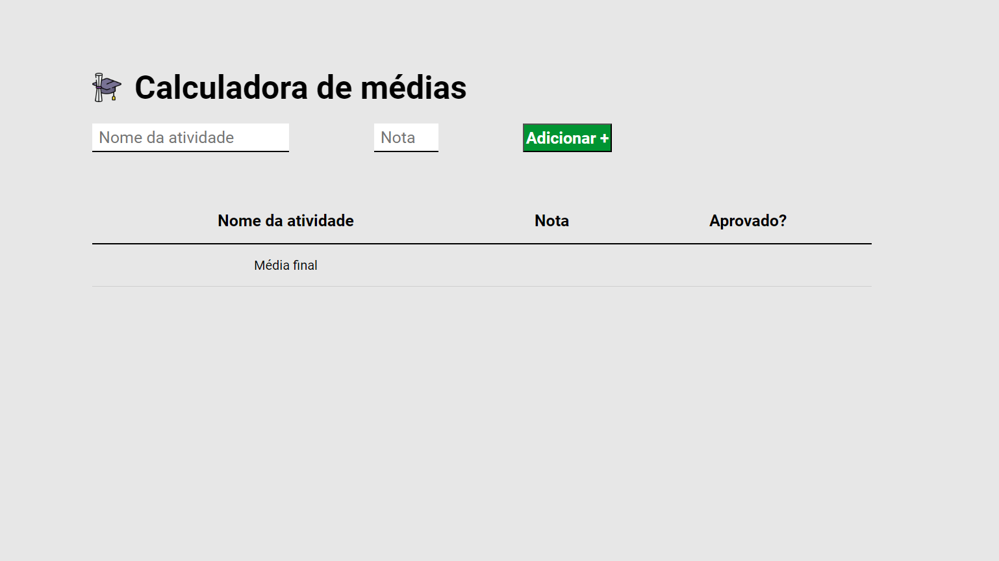
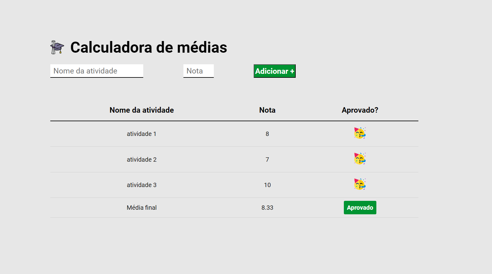
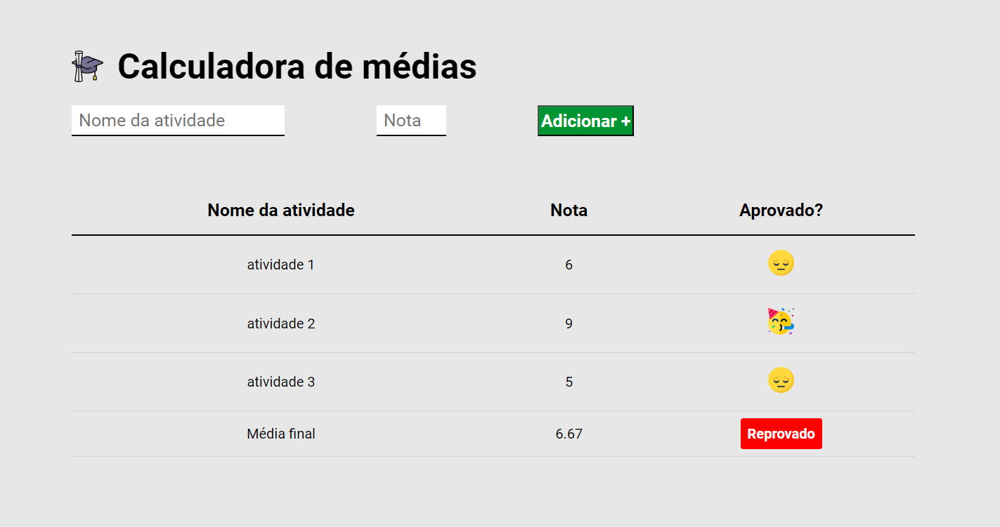

# Average Score Calculator


This application explores the use of the DOM to dynamically display information on the screen as the user interacts with it. It functions as a calculator for students' average scores, indicating whether the student achieved the individual passing score for each activity and providing the overall average score, considering all activities entered by the user.

## Index
- <a href="#functionalities">Application functionalities</a>
- <a href="#layout">Layout</a>
- <a href="#demonstration">Demonstration</a>
- <a href="#run">How to run the application</a>
- <a href="#tecnologies-used">Tecnologies used</a>
- <a href="#developer">Developer</a>

## Application functionalities
 - [x]  Average calculation
 - [x]  Information shown as the user interacts with the application

## Layout





## Demonstration

https://github.com/Julia-slvbrg/average-score-calculator/assets/114543081/83eb3108-b8d0-462c-a3dd-ec472b512b47


## How to run the application
```bash
# Clone this repository
$ git clone repolink

# Acess the app folder on your terminal
$ cd average-score-calculator

# Utilize a local server launch tool to view the application in your browser

```

## Tecnologies used
1. HTML
2. CSS
3. DOM
4. Javascript

## Developer
[LinkedIn](https://www.linkedin.com/in/julia-silva-borges/)
